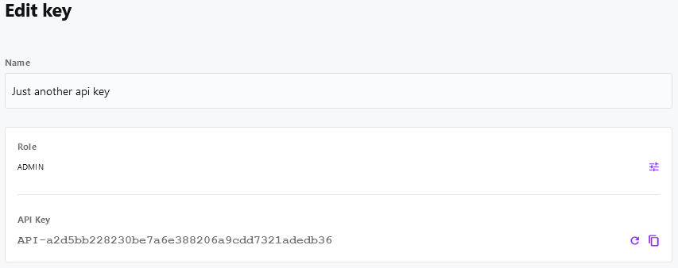

# Authentication

[[toc]]

## Introduction

Generally speaking, authenticating with Cockpit's API is pretty easy.

1. Whenever you want to fetch data from any REST-API endpoint via HTTP request a token should be passed inside every request's **api-key** header value.
2. In addition, it's REST-API endpoint, Cockpit also provides a GraphQL based API. Authenticating with the GraphQL API also requires a token to be passed.

> In the following examples we use **USR-b2a6ef408b69a2ea86ea065a6d2301a8b4a535bc** as an example API key.

## The public API

::: danger Caution!
Bad public API configuration probably exposes data to the world wide web without restrictions. Even worse, it can result in having unauthenticated users delete or write data to Cockpit using the API.
:::

The public API is Cockpit's way of providing access to data for unauthenticated clients. In some cases you may want to give all clients - even unauthenticated ones - access to assets, collections, singletons, pages or other data stored in Cockpit.

You can make this work by using the *public API*:

1. Navigation to **/system/api/public**
2. Select a [Role](/concepts/roles-permissions/)
    * Make sure to select an appropriate role, if not available
    * create a custom role used by the public API only, so things don't get mixed up
3. Click *Save* to save the changes
4. Congratulations, your public API is now available with permissions from your selected role.

## Additional API keys

In addition to user-based [API keys](/concepts/users/) Cockpit provides the option to create custom API keys, that do not belong to a user.

Foreach API key the following data has to be provided:

* **name**: the API key name, should make it easy to recognize the purpose of the API key
* **role**: the [Role](/concepts/roles-permissions/) defines the permissions when accessing Cockpit's API with this key
* **API-key**: the unique API key token, ca be refreshed anytime

Example:




## Managing tokens

### How to create a token

1. Login to your Cockpit installation at [https://cockpit.example.com](https://cockpit.example.com)
2. Navigate to your user's profile at [https://cockpit.tld/system/users/user](https://cockpit.tld/system/users/user) or the profile of the user you want to create a token for
3. Create an API key if not available yet
4. Copy the API key to your clipboard
5. Click *Update* to save your user account changes

### How to invalidate a token

1. Login to your Cockpit installation at [https://cockpit.example.com](https://cockpit.example.com)
2. Navigate to your user's profile at [https://cockpit.tld/system/users/user](https://cockpit.tld/system/users/user) or the profile of the user you want invalidate a token for
3. In the *API Key* section click *Refresh* to generate a new token
4. The old token is now invalid

## REST-API

### Authenticate using a token

As soon as you have generated an API-token, using Cockpit's REST-API is pretty straightforward. Put the token inside the HTTP-request headers for every single request.

<CodeGroup>
  <CodeGroupItem title="cURL">

```bash:no-line-numbers
curl -X GET "https://cockpit.tld/api/pages/menus" \
 -H "api-key: USR-b2a6ef408b69a2ea86ea065a6d2301a8b4a535bc"
```

  </CodeGroupItem>

  <CodeGroupItem title="JavaScript" active>

```javascript:no-line-numbers
fetch('https://cockpit.tld/api/pages/menus', {
  method: 'GET',
  headers: {
    "api-key": "USR-b2a6ef408b69a2ea86ea065a6d2301a8b4a535bc"
  }
})
.then(response => response.json())
.then(response => console.log(response));
```

  </CodeGroupItem>
</CodeGroup>

### Using API endpoints without tokens - the public API

In some cases you might expect Cockpit to provide data for your application without using an API-token. If you do, there's a couple of steps required to make it work.

In a nutshell, the public API works by [configuring a user role](/concepts/roles-permissions/) to use in the public API (unauthenticated requests). As every role has a configurable set of permissions to your content, it usually takes just a couple of minutes to set everything up at your expectations. However, it still gives you control over Cockpit's data by restricting access for the public API.

1. Login to your Cockpit installation at [https://cockpit.example.com](https://cockpit.example.com)
2. Navigate to the roles section at [https://cockpit.tld/system/users/roles](https://cockpit.tld/system/users/roles)
3. Click *Add role*
4. Ensure to provide an appid (i.e. *public*), a suitable name (i.e. *Public API*) and set permissions at will
5. Save the new role
6. Afterwards go to the API section at [https://cockpit.tld/system/api](https://cockpit.tld/system/api)
7. Click *Public API*
8. Click *No role set* below the *Role* and choose your role (*Public API* if you followed our suggestion above)
9. Click *Save* to finish the setup
10. You can now use the API endpoints, the created role hast permission to

<CodeGroup>
  <CodeGroupItem title="cURL">

```bash:no-line-numbers
curl -X GET "https://cockpit.tld/api/pages/menus"
```

  </CodeGroupItem>

  <CodeGroupItem title="JavaScript" active>

```javascript:no-line-numbers
fetch('https://cockpit.tld/api/pages/menus', {
  method: 'GET'
})
.then(response => response.json())
.then(response => console.log(response));
```

  </CodeGroupItem>
</CodeGroup>

## GraphQL

::: warning Work in progress
This section is still missing content. We are currently working on it.
:::

## Further reading

* If you want to read about Cockpit's *Roles & Permissions* system in depth, just have a look at this documentation's [Roles & Permissions](/concepts/roles-permissions/) section.
