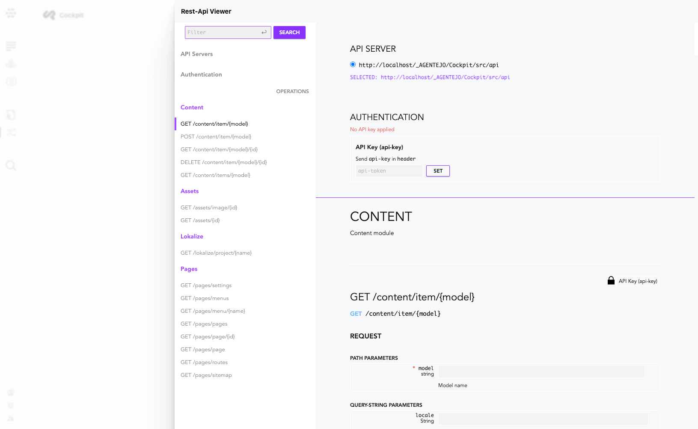

# Introduction

This documentation of API endpoints provides additional information on each endpoint and shows usage examples. If you want to know about each endpoint in detail we recommend using Cockpit's API playground.

## API playground

Cockpit provides two useful API playgrounds.

1. The REST-API playground
2. The GraphQL playground

Navigate to **/system/api** in order to test and query your API endpoints with real data.

