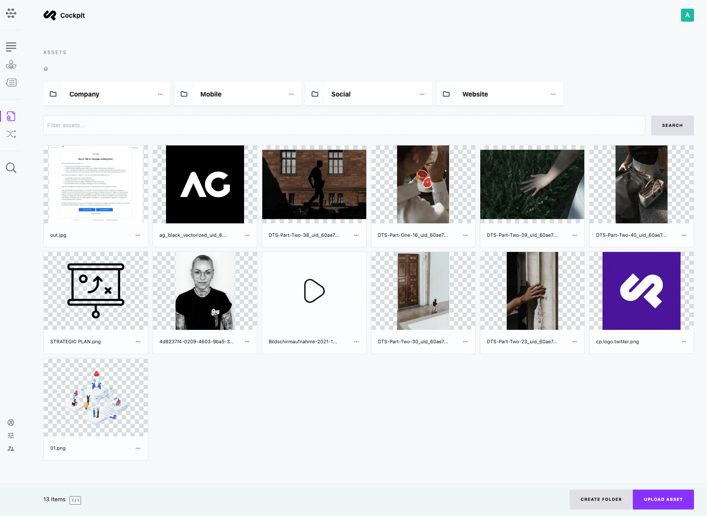

# Assets

[[toc]]

## Introduction

You ask yourself what assets are? Some of the most important assets on most websites are images and documents.



## How to manage assets

Cockpit provides you with a couple of out-of-the box features, that make managing assets pretty straightforward:

* Search existing assets
* Organize assets in folders
* Upload new assets from
  * your local hard disk (your device if on a smartphone)
  * from your device's camera
  * a screencast (video)

## Asset details

As soon as an asset was uploaded you can edit title and description as well as assign tags. Moreover, you can replace the file of your asset, which allows updating i.e. a product sheet with a new version with all references to the asset remaining valid.

## Improving Thumbnail Generation

While GD is the default tool for thumbnail generation, we're exploring the integration of `vipsthumbnail` from the VIPS image processing library to enhance performance, particularly for large images.

### Default Method: GD

Currently, our project uses the GD library for generating thumbnails. GD is widely used due to its simplicity and broad support across different platforms. However, it may not be the most efficient choice, especially when dealing with large images.

### `vipsthumbnail` for Enhanced Performance

We propose using `vipsthumbnail` as an alternative to GD for thumbnail generation. `vipsthumbnail`, part of the VIPS image processing library, offers several advantages over GD:

- **Performance Efficiency:** It is significantly faster in processing large images.
- **Low Memory Usage:** `vipsthumbnail` consumes less memory, making it more efficient for high-resolution images.
- **Advanced Features:** It provides features like smart cropping, which GD lacks.

### Configuration Update

To enable `vipsthumbnail`, update the configuration file at `/config/config.php`:

```php
'assets' => [
    'vips' => '/opt/homebrew/bin/vipsthumbnail',
],
```

This update specifies the path to the vipsthumbnail executable, allowing our application to utilize its advanced thumbnail generation capabilities.

### Implementation Steps

1. Open the `/config/config.php` file in your editor.
2. Find the assets array.
3. Insert the vips key with the path to vipsthumbnail.
4. Save the file.

After applying this change, our system will use vipsthumbnail for generating thumbnails, which is expected to improve performance, particularly for large images.

Ensure `vipsthumbnail` is installed on your server. For more information on installation and configuration, visit the [VIPS website](https://www.libvips.org).


## Further reading

* Detailed information about fetching assets from the Cockpit API can be found at [API](/api/assets).