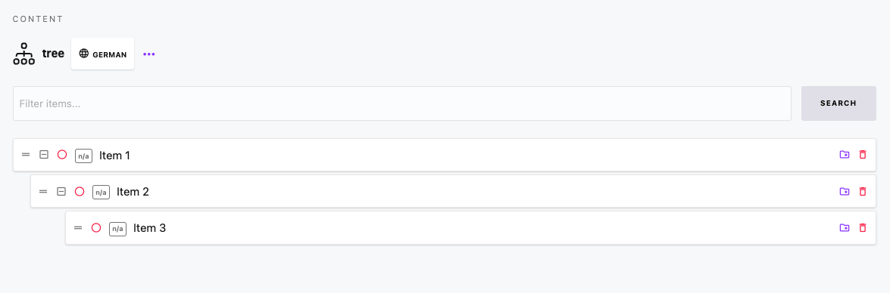

# Content

[[toc]]

## Introduction

With this version of Cockpit content is organized in so-called content models. You can create a content model for a collection of items or just one single item - type and structure specified when creating the content model.

A content model consists of the fields you define, with each field belonging to one of Cockpit's [Field types](/concepts/fields). Depending on the fields configured you can than create items containing the required data.

## Understanding Content Structures (Collections, Singletons, Trees)

In Cockpit, content modeling is the process of defining how your content is structured. This allows content editors to manage information easily while providing developers with predictable data via the API. Cockpit offers three primary structure types for your content, created and managed within the Admin UI (typically under sections like "Content" or "Settings"):

1.  **Collections:** For lists or groups of similar items.
2.  **Singletons:** For unique, single pieces of content or configuration.
3.  **Trees:** For content items that need a hierarchical (parent-child) relationship.

Choosing the right type is fundamental to building an effective and maintainable content backend. Let's explore each one.

---

### Collections: For Lists of Similar Content

* **What it is:** A Collection is used to manage **multiple content items (entries)** that all share the **exact same structure** (i.e., the same set of fields). Think of it like a database table or a spreadsheet where each row is an item, and the columns are the defined fields.
* **Use Cases:** Collections are ideal when you need to manage lists of content, such as:
    * Blog Posts
    * Products
    * News Articles
    * Events
    * Team Members
    * Testimonials
    * Portfolio Items
    * Job Listings
* **Key Characteristics:**
    * Contains **multiple entries**.
    * All entries share the **same fields** (defined once for the Collection).
    * Designed for content that needs to be listed, filtered, sorted, or paginated.
* **API Interaction:** When you query a Collection via the API, you typically receive an array (list) of content items. You can often apply parameters to filter, sort, limit, or paginate these results.

---

### Singletons: For Unique Content Blocks or Settings

* **What it is:** A Singleton represents a **single, unique instance** of a content structure. Unlike a Collection, it doesn't contain multiple entries; it *is* the entry itself.
* **Use Cases:** Singletons are perfect for managing content for specific, non-repeatable parts of a site or application, or for global settings:
    * Homepage content blocks (e.g., Hero section, Featured content).
    * "About Us" page content.
    * Global website settings (e.g., Site Title, Logo, Footer Text).
    * Contact page information (address, phone number, map coordinates).
    * Configuration data needed by the frontend.
* **Key Characteristics:**
    * Represents **only one** content instance.
    * Has its own defined set of fields.
    * Ideal for one-off content elements or configuration objects.
* **API Interaction:** When you query a Singleton via the API, you receive a single JSON object containing the data for that specific Singleton instance.

---

### Trees: For Hierarchical Content

* **What it is:** A Tree is similar to a Collection in that it manages **multiple content items** sharing the **same structure**. However, the key difference is that Trees allow items to have **parent-child relationships**, creating a nested hierarchy.
* **Use Cases:** Trees are the best choice when the order and nesting level of your content items are important:
    * Website navigation menus (main menu items with sub-menus).
    * Category structures (e.g., Product categories with sub-categories).
    * Documentation chapters and sections.
    * Organizational charts.
    * Site maps.
* **Key Characteristics:**
    * Contains **multiple entries**.
    * All entries share the **same fields**.
    * Entries can be **nested** under parent entries, creating a hierarchy.
* **API Interaction:** The API for Trees typically allows you to fetch the entire structure, specific branches, or information about an item's parent or children, preserving the hierarchical relationships.

---

### Choosing the Right Type: A Quick Guide

Ask yourself these questions about the content you need to manage:

* **Do I need a list of many items that look the same?**
    * Use a **Collection**. (e.g., Blog Posts)
* **Do I need to manage content for just one specific thing or a settings page?**
    * Use a **Singleton**. (e.g., Homepage Hero Content, Site Settings)
* **Do I need a list of items where items can be nested under other items?**
    * Use a **Tree**. (e.g., Navigation Menu, Categories)

---

## Collection

### The basics

Collections help you to define a content model of type *Collection*. After you created the content model you can add as many items as you wish. All items of a collection then rely on the structure of the content model.

The following sections describes how collections work by example. Other examples would be faq, products, ...

### Create a content model

1. Login to your Cockpit installation
2. Navigate to *Content*
3. Click *Create model*
4. As *Type* select *Collection* so we can create lots of items later on
5. Fill in the fields
    * Name: `employee`
    * Display name: `Employee`
6. Continue by adding a field to the model by clicking *plus*
7. Fill in the fields
    * Name: `name` (camel case recommended. E.g. `nickName`)
    * Type: `Text` (default)
    * Display name: `Name`
    * Required: `yes`
8. Click *Add field* to add the field
9. Click *Create model* to save

### Add items to your collection

1. Navigate to *Content*
2. In the list of collection you should see your *Employee* collection
3. Click on it to start adding items
4. Click *Create item*
5. Fill in the fields
    * Name: `Employee A` (or another unique name, you did not use before)
6. Click *Create item* again to save the item to collection
7. Afterwards make sure to *publish* the item using the dropdown for *State* in the right
8. You can now
    * continue to add items by starting at 1. again
    * or stop here and use your content

## Singleton

For *Singletons* we keep the documentation rather short because basically a singleton works the same way the [Collection](#collections) content model does.

The one and only major difference is, that for a singleton content model only one item exists. You would use a singleton whenever creating multiple items of the content model does not make sense at all.

## Tree

Content models of the type *tree* allows you to manage your content in a so called tree structure or in a parent / child model. This is usefull if you want to manage e.g. nested categories or implement anything that involves a need for a hirarchy for content items.

Okay, here is documentation explaining the different content structure types in Cockpit: Collections, Singletons, and Trees.

---

### Conclusion

Understanding the distinction between Collections, Singletons, and Trees is crucial for effective content modeling in Cockpit. By selecting the appropriate structure type for each piece of content, you create an intuitive editing experience for content managers and a logical, predictable data source for developers consuming the API.

## Further reading

* Detailed information about fetching content from the Cockpit API can be found at [API](/api/content).
