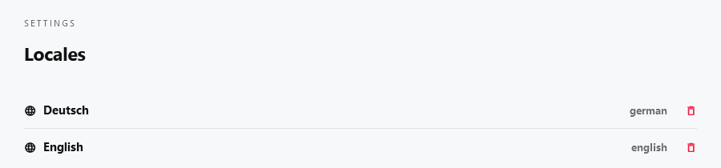

# Localization

[[toc]]

## Introduction

Use Cockpit's locales settings and localization features whenever you need to translate your content in [Collections](/concepts/content/#collections) or  [Singletons](/concepts/content/#singletons).

*Locales* define the languages you want to use in your content. Define and use locals whenever you want to provide content in different translations.

## Managing locales

You can set up localization as described in the following steps:

1. Login to your Cockpit installation
2. Navigate to *Settings > Locales*
3. See the list of locales, that have already been created
4. Add new locales or modify existing locales

## Enable localized content for fields

In order to localize content you need to enabled localization by activating the *localize field* option foreach field you want to localize on your content models.

## How to localize content

After you enabled *localize field* as described in [Enable localized content for fields](#enable-localized-content-for-fields) the field can be translated using any of your [Locales](#managing-locales).

1. Login to your Cockpit installation
2. Navigate to *Content*
3. See the list of collections and singletons
4. Click the collection you want to add or modify content for
5. Display the locales you want to translate in the right section called *Translation*
6. Provide different content foreach localized field
7. That's it. Localized content will be available from Cockpit's [API](/api/endpoints/#content)

