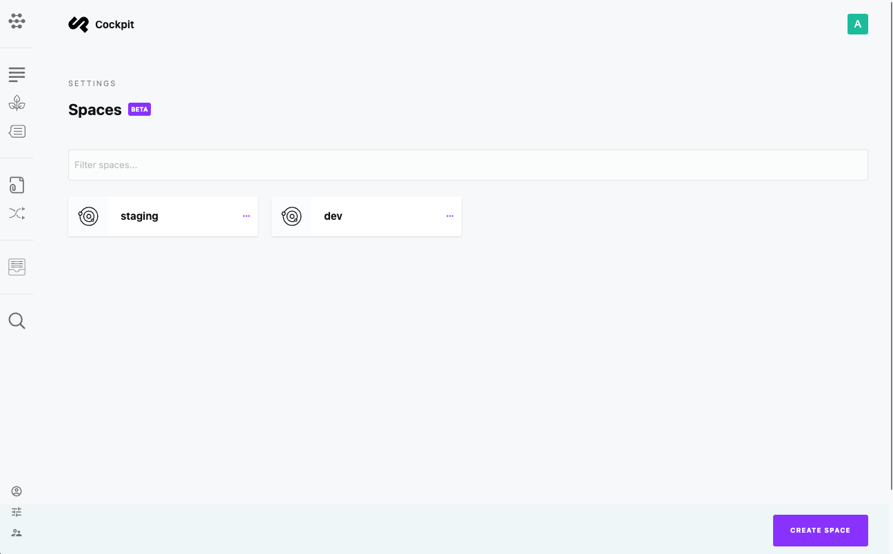

# Spaces

Spaces allows multi-tenancy within Cockpit. A Cockpit space is an isolated sub-instance of Cockpit.

## Create a space

1. Login to your Cockpit installation
2. Navigate to *Settingsm > Spaces*
3. Click *Create space*

:::info
Spaces can only be created within the main Cockpit instance.
:::

After you've created a space, a dedicated space folder is created in the **`.spaces`** folder located in the root path of the main instance.

The space folder has it's own config and storage folder.

## Space Addons

In general all addons available in the main Cockpit instance will be available within a space instance.

By creating an addons folder in **`.spaces/{space-folder}`**, you can also load custom addons only for that space.