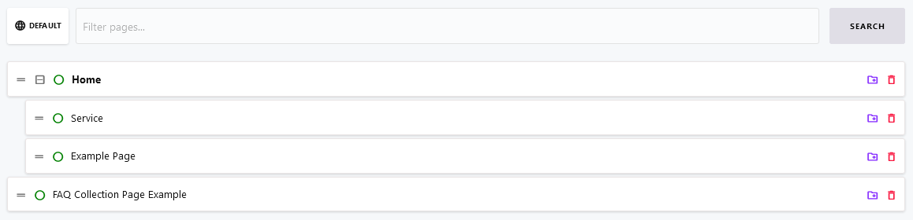

# Pages

::: tip Important notes
Note, that addons may have to be installed manually because they are not shipped with Cockpit's default setup.

Also note, that we use [https://cockpit.example.com](https://cockpit.example.com) as domain in our examples, which has to be replaced by your domain in all code snippets or links below.
:::

[[toc]]

## Introduction

*Pages* are Cockpit's way of creating pages as required for websites or applications. Usually pages contain content organized in a special [Layout](/features/basics/#layout). As a headless cms Cockpit stores and serves page data over its API for [Pages](/addons/pages/#api). The client fetching data from Cockpit's API should render the data provided by the API.

## Features

### About managing pages

#### The list of pages

1. Login to your Cockpit installation at [https://cockpit.example.com](https://cockpit.example.com)
2. Navigate to *Pages* at [https://cockpit.example.com/pages](https://cockpit.example.com/pages)
3. See the list of pages, that have already been created



Note, that pages can be organized in a menu like way by dragging and dropping a page as a child of other pages. 

#### Create or edit a page

Each *Page* contains some common fields, such as a title, a slug and the [SEO](/features/basics/#seo) part. All additional content is organized in a [Layout](/features/basics/#layout). Use the layout to create highly flexible and customized content foreach of your pages.

### Menus

While pages themselves are standalone pieces of data they are usually organized within one or more menus. Whenever you require a menu i.e. in the header or footer of a website, Cockpit's *Menus* feature can be used to organize your pages.


## API

### Menus

Use the *Menus*-API endpoint whenever you want to fetch the full list of all of your menus.

Endpoint: `GET /pages/menus`

<CodeGroup>
  <CodeGroupItem title="cURL">

```bash:no-line-numbers
curl -X GET "https://cockpit.example.com/api/pages/menus" \
 -H "api-key: USR-b2a6ef408b69a2ea86ea065a6d2301a8b4a535bc"
```

  </CodeGroupItem>

  <CodeGroupItem title="JavaScript" active>

```javascript:no-line-numbers
fetch('https://cockpit.example.com/api/pages/menus', {
  method: 'GET',
  headers: {
    "api-key": "USR-b2a6ef408b69a2ea86ea065a6d2301a8b4a535bc"
  }
})
.then(response => response.json())
.then(response => console.log(response));
```

  </CodeGroupItem>
</CodeGroup>

### Menu

Whenever you want to fetch one menu from Cockpit the *Menu*-API endpoint can be used.

Endpoint: `GET /pages/menu/{name}`

Example: For a menu *main* the menu data can be fetched using the following request.

<CodeGroup>
  <CodeGroupItem title="cURL">

```bash:no-line-numbers
curl -X GET "https://cockpit.example.com/api/pages/menu/main" \
 -H "api-key: USR-b2a6ef408b69a2ea86ea065a6d2301a8b4a535bc"
```

  </CodeGroupItem>

  <CodeGroupItem title="JavaScript" active>

```javascript:no-line-numbers
fetch('https://cockpit.example.com/api/pages/menu/main', {
  method: 'GET',
  headers: {
    "api-key": "USR-b2a6ef408b69a2ea86ea065a6d2301a8b4a535bc"
  }
})
.then(response => response.json())
.then(response => console.log(response));
```

  </CodeGroupItem>
</CodeGroup>

### Pages

Use the *Pages*-API endpoint whenever you want to fetch the full list of all of your pages.

Endpoint: `GET /pages/pages`

<CodeGroup>
  <CodeGroupItem title="cURL">

```bash:no-line-numbers
curl -X GET "https://cockpit.example.com/api/pages/pages" \
 -H "api-key: USR-b2a6ef408b69a2ea86ea065a6d2301a8b4a535bc"
```

  </CodeGroupItem>

  <CodeGroupItem title="JavaScript" active>

```javascript:no-line-numbers
fetch('https://cockpit.example.com/api/pages/pages', {
  method: 'GET',
  headers: {
    "api-key": "USR-b2a6ef408b69a2ea86ea065a6d2301a8b4a535bc"
  }
})
.then(response => response.json())
.then(response => console.log(response));
```

  </CodeGroupItem>
</CodeGroup>

### Page

#### Fetching a page by slug

Whenever you want to fetch a single page item by page *slug* the *Page*-API can be used.

Endpoint: `GET /pages/page`

Example: For a page with slug *home* the data can be fetched using the following request. Make sure to prefix your page's slug when passing as parameter, i.e. `route=/home` for the slug *home*

<CodeGroup>
  <CodeGroupItem title="cURL">

```bash:no-line-numbers
# Note: the route GET param is URL decoded: /home => %2Fhome
curl -X GET "https://cockpit.example.com/api/pages/page?route=%2Fhome" \
 -H "api-key: USR-b2a6ef408b69a2ea86ea065a6d2301a8b4a535bc"
```

  </CodeGroupItem>

  <CodeGroupItem title="JavaScript" active>

```javascript:no-line-numbers
fetch('https://cockpit.example.com/api/pages/page?route=/home', {
  method: 'GET',
  headers: {
    "api-key": "USR-b2a6ef408b69a2ea86ea065a6d2301a8b4a535bc"
  }
})
.then(response => response.json())
.then(response => console.log(response));
```

  </CodeGroupItem>
</CodeGroup>

#### Fetching a page by id

Whenever you want to fetch a single page item by id the *Page*-API can be used.

Endpoint: `GET /pages/page/{id}`

Example: For a page with id *3bfc72d9343631c575000111* the data can be fetched using the following request.

<CodeGroup>
  <CodeGroupItem title="cURL">

```bash:no-line-numbers
curl -X GET "https://cockpit.example.com/api/pages/page/3bfc72d9343631c575000111" \
 -H "api-key: USR-b2a6ef408b69a2ea86ea065a6d2301a8b4a535bc"
```

  </CodeGroupItem>

  <CodeGroupItem title="JavaScript" active>

```javascript:no-line-numbers
fetch('https://cockpit.example.com/api/pages/page/3bfc72d9343631c575000111', {
  method: 'GET',
  headers: {
    "api-key": "USR-b2a6ef408b69a2ea86ea065a6d2301a8b4a535bc"
  }
})
.then(response => response.json())
.then(response => console.log(response));
```

  </CodeGroupItem>
</CodeGroup>

### Routes

By using the *Routes*-API endpoint you can fetch the list of all routes for pages. In contrast to the [Pages](#pages-1)-API endpoint it does not return page content, but just a lightweight response of routes, slugs and page types. If the `locale` parameter is not provided all routes are grouped by locale and all locales are returned.

Endpoint: `GET /pages/routes`

<CodeGroup>
  <CodeGroupItem title="cURL">

```bash:no-line-numbers
curl -X GET "https://cockpit.example.com/api/pages/routes" \
 -H "api-key: USR-b2a6ef408b69a2ea86ea065a6d2301a8b4a535bc"
```

  </CodeGroupItem>

  <CodeGroupItem title="JavaScript" active>

```javascript:no-line-numbers
fetch('https://cockpit.example.com/api/pages/routes', {
  method: 'GET',
  headers: {
    "api-key": "USR-b2a6ef408b69a2ea86ea065a6d2301a8b4a535bc"
  }
})
.then(response => response.json())
.then(response => console.log(response));
```

  </CodeGroupItem>
</CodeGroup>

### Settings

By using the *Settings*-API endpoint you can fetch the settings for pages. This contains SEO metadata as well as images, scripts and more.

Endpoint: `GET /pages/settings`

<CodeGroup>
  <CodeGroupItem title="cURL">

```bash:no-line-numbers
curl -X GET "https://cockpit.example.com/api/pages/settings" \
 -H "api-key: USR-b2a6ef408b69a2ea86ea065a6d2301a8b4a535bc"
```

  </CodeGroupItem>

  <CodeGroupItem title="JavaScript" active>

```javascript:no-line-numbers
fetch('https://cockpit.example.com/api/pages/settings', {
  method: 'GET',
  headers: {
    "api-key": "USR-b2a6ef408b69a2ea86ea065a6d2301a8b4a535bc"
  }
})
.then(response => response.json())
.then(response => console.log(response));
```

  </CodeGroupItem>
</CodeGroup>

### Sitemap

The *Sitemap*-API endpoint returns the complete sitemap of pages.

Endpoint: `GET /pages/sitemap`

<CodeGroup>
  <CodeGroupItem title="cURL">

```bash:no-line-numbers
curl -X GET "https://cockpit.example.com/api/pages/sitemap" \
 -H "api-key: USR-b2a6ef408b69a2ea86ea065a6d2301a8b4a535bc"
```

  </CodeGroupItem>

  <CodeGroupItem title="JavaScript" active>

```javascript:no-line-numbers
fetch('https://cockpit.example.com/api/pages/sitemap', {
  method: 'GET',
  headers: {
    "api-key": "USR-b2a6ef408b69a2ea86ea065a6d2301a8b4a535bc"
  }
})
.then(response => response.json())
.then(response => console.log(response));
```

  </CodeGroupItem>
</CodeGroup>

## Further reading

* An overview of addons is provided at [Addons](/addons/) 
* The complete reference of layout components for composing layouts can be found at [Layout](/features/basics/#layout-1).