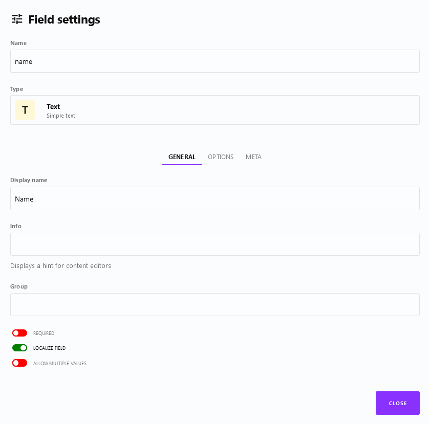
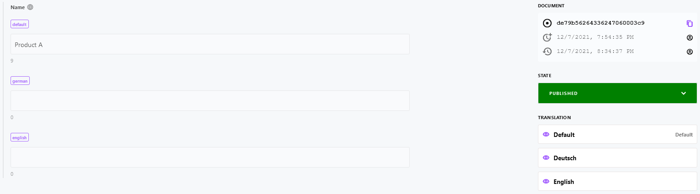

# Localization

::: tip Important notes
Note, that we use [https://cockpit.example.com](https://cockpit.example.com) as domain in our examples, which has to be replaced by your domain in all code snippets or links below.
:::

[[toc]]

## Introduction

Use Cockpit's locales settings and localization features whenever you need to translate your content in [Collections](/features/content/#collections), [Singletons](/features/content/#singletons) or [Pages](/addons/pages). 

## Prerequisites

Before localizing Cockpit's content you have to setup the available locales as described in [Locales](/settings-administration/locales/#managing-locals).

## Enable localized content for fields

In order to localize content you need to enabled localization by activating the *localize field* option foreach field you want to localize on your content models.

## How to localize content

After you enabled *localize field* as described in [Enable localized content for fields](#enable-localized-content-for-fields) the field can be translated using any of your [Locales](#managing-locales).

1. Login to your Cockpit installation at [https://cockpit.example.com](https://cockpit.example.com)
2. Navigate to *Content* at [https://cockpit.example.com/content](https://cockpit.example.com/content)
3. See the list of collections and singletons
4. Click the collection you want to add or modify content for
5. Display the locales you want to translate in the right section called *Translation*
6. Provide different content foreach localized field
7. That's it. Localized content will be available from Cockpit's [API](/api/endpoints/#content)

## Further reading

* Detailed information about fetching content from the Cockpit API can be found at [API](/api/endpoints/#content).
* The complete reference of field types for composing content models can be found at [Features](/features/basics/#field-types).