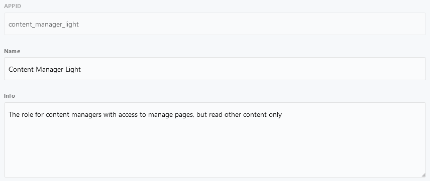
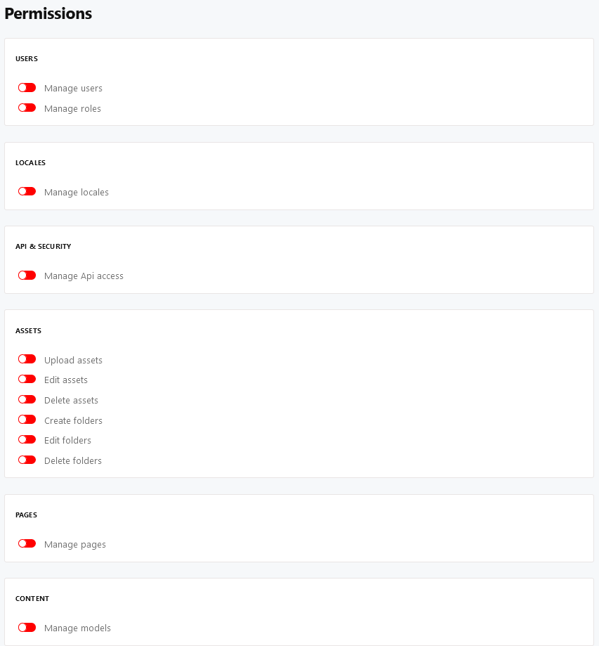
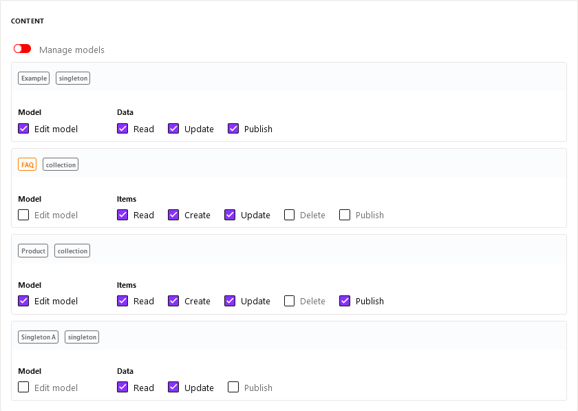

# Roles & Permissions

::: tip Important notes
Note, that we use [https://cockpit.example.com](https://cockpit.example.com) as domain in our examples, which has to be replaced by your domain in all code snippets or links below.
:::

[[toc]]

## Introduction

Cockpit's user system is basically role based. Each user is assigned to a role, that defines the user's permissions. A role has the following properties

* **id**: the identifier of the role
* **name**: the name of the role - displayed i.e. when managing [users](/settings-administration/users/)
* **info**: further information for describing the role's purpose, usage, ...

Example:

## How to use roles

Whenever you want to provide access to your Cockpit installation, you are likely going to create a user. If the user needs a special subset of [permissions](#permissions) i.e. restricted to a certain collection and / or managing pages, this can be achieved by creating a new role. After the role was successfully created and configured it can be assigned to any number of existing or future users.

### What about the admin role?

On a fresh installation of Cockpit one might wonder why there are not any roles listed in [https://cockpit.example.com/system/users/roles](https://cockpit.example.com/system/users/roles).

The *Admin* role, which is assigned to the automatically created first user, does not show up in the list because it grants all permissions by default and this behaviour can not be changed. Whenever you want to create a special kind of admin role just make sure to create a new one with a new unique name i.e. Custom Admin, Manager, ...

## Permissions

### The basic features

In any case Cockpit provides options for giving permission to core features:

* Api & security
* Assets
* Content
* Locales
* Pages
* Users
  * Manage users
  * Manage roles

### How to manage permissions for collections and singletons?

As described in [the basic features](#the-basic-features) there's permissions for *Content* available. In contrast to other permissions the *Content* permission provides the possibility to set detailed permission based on concrete collections or singletons you created. 

This allows you to give one role the permission to edit and view a collection i.e. *Collection A* whereas another role has access to read i.e. *Collection B* only.

Example:

### Addon permissions

In addition to permissions for Cockpit's core features there exist permissions to [Addons](/addons/) also. Note, that permissions for addons are displayed only if any addons were installed.

## Further reading

* For more information on managing users continue reading at [Users](/settings-administration/users/).
* Detailed information about the automatically created admin user is available at [Installation](/about/installation/).