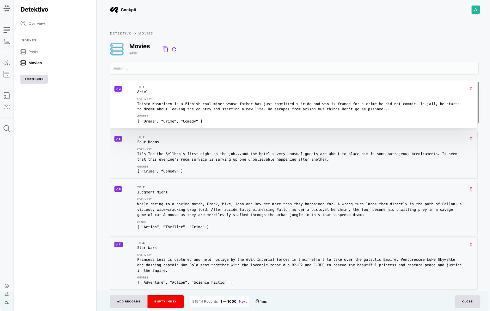

# Detektivo

Detektivo is a powerful full-text search and indexing addon for Cockpit CMS. It provides lightning-fast search capabilities with support for fuzzy matching, faceted filtering, and multiple storage backends.

[[toc]]

## Overview

Detektivo streamlines content search without requiring third-party services like Algolia or Elasticsearch for small to mid-size projects. For larger deployments, it seamlessly integrates with Meilisearch for enhanced performance.



## Features

- **Full-Text Search**: Search across all indexed content
- **Fuzzy Matching**: Find results even with typos
- **Faceted Filtering**: Filter results by categories, tags, etc.
- **Real-Time Indexing**: Content updates are immediately searchable
- **Multi-Language Support**: Search works across all locales
- **Two Storage Backends**: SQLite FTS5 or Meilisearch

## Storage Backends

### SQLite FTS5 (Default)

The default backend uses SQLite's Full-Text Search 5 extension. No additional configuration is needed - it works out of the box.

**Best for:**
- Small to mid-size projects
- Simple deployment requirements
- Projects without external dependencies

### Meilisearch

[Meilisearch](https://www.meilisearch.com/) is an open-source search engine that provides advanced features and better performance for larger datasets.

**Best for:**
- Large content repositories
- High-traffic applications
- Advanced search requirements (typo tolerance, synonyms, etc.)

## Configuration

### SQLite (Default)

No configuration required. Detektivo automatically uses SQLite FTS5.

### Meilisearch

Add to `/config/config.php`:

```php
<?php

return [
    'search' => [
        'server' => 'meilisearch://localhost:7700',
        'options' => [
            'api_key' => getenv('MEILISEARCH_KEY')
        ]
    ]
];
```

Set in your `.env` file:

```
MEILISEARCH_KEY=your-master-key
```

#### Meilisearch with Custom URL

```php
'search' => [
    'server' => 'meilisearch://search.yourdomain.com',
    'options' => [
        'api_key' => getenv('MEILISEARCH_KEY')
    ]
]
```

## Creating Indexes

### Via Admin Interface

1. Navigate to **Detektivo** in the admin menu
2. Click **Add Index**
3. Configure the index:

| Field | Description |
|-------|-------------|
| **Name** | Unique identifier for the index |
| **Label** | Display name |
| **Source** | Content model to index (Collection, Singleton, Tree) |
| **Fields** | Fields to include in the index |
| **Filters** | Optional conditions for which items to index |

4. Click **Save** to create the index
5. Click **Rebuild** to populate the index with existing content

### Index Configuration

When creating an index, you specify:

- **Source Model**: Which collection, singleton, or tree to index
- **Indexed Fields**: Which fields should be searchable
- **Filter Criteria**: Optional filters to include only certain items

## Managing Indexes

### Rebuilding Indexes

If content was added before the index existed, or if you change index configuration:

1. Open the index in Detektivo
2. Click **Rebuild Index**

This reprocesses all matching content and updates the search index.

### Automatic Updates

Once an index is created, Detektivo automatically:

- Adds new content when created
- Updates index entries when content changes
- Removes entries when content is deleted

## Search Features

### Basic Search

Search across all indexed fields:

```
laptop computer
```

### Phrase Search

Search for exact phrases:

```
"gaming laptop"
```

### Fuzzy Search (Meilisearch)

Meilisearch automatically handles typos:

```
laptpo  → finds "laptop"
```

### Filtering (Meilisearch)

Combine search with filters:

```
?q=laptop&filter=category:electronics
```

## Best Practices

### Index Design

- **Be Selective**: Only index fields that need to be searchable
- **Group Related Content**: Consider creating multiple indexes for different search contexts
- **Use Filters**: Limit indexes to relevant content (e.g., published items only)

### Performance

- **SQLite**: Works well for up to ~50,000 documents
- **Meilisearch**: Recommended for larger datasets or heavy search traffic

### Content Considerations

- Index text content, not complex nested structures
- Consider which locales need to be searchable
- Use meaningful field names for faceted navigation

## Troubleshooting

### Search Returns No Results

- Verify the index has been rebuilt after content changes
- Check that queried terms exist in indexed fields
- Ensure content matches any index filters

### Meilisearch Connection Issues

- Verify server URL is correct
- Check API key permissions
- Ensure Meilisearch is running and accessible

### Index Not Updating

- Check Cockpit logs for indexing errors
- Verify content model hasn't changed
- Try rebuilding the index manually
