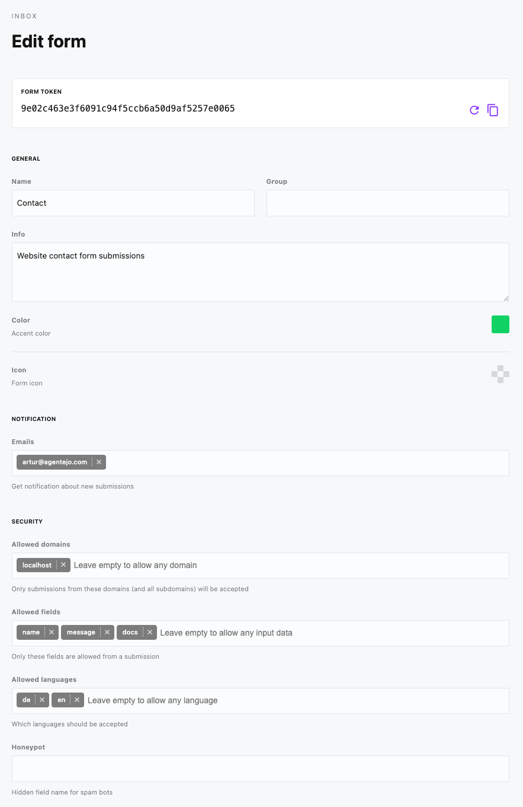

# Inbox

Accept submissions from custom forms - including file uploads.

## Quick Setup

```html
<form action="/api/inbox/submit/{form-token}" method="POST">
    <label for="email-address">Email Address</label>
    <input type="email" id="email" name="data[email]" required>
    <label for="email-message">Message</label>
    <textarea type="email" id="message" name="data[message]" required></textarea>
    <button type="submit">Submit</button>
</form>
```

## Form settings

Inbox provides multiple options for notification and security settings.



## File Uploads

To accept file uploads is really easy. You simply have to add enctype="multipart/form-data" to your form tag and you're all set.

```html
<form accept-charset="UTF-8" action="/api/inbox/submit/{form-token}" enctype="multipart/form-data" method="POST">
...
<input type="file" name="data[resume]" ></input>
...
</form>
```