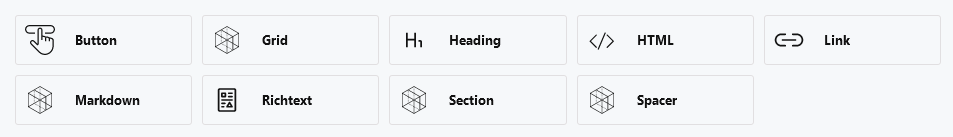

# Layout

Build visual page layouts with a drag-and-drop component system that outputs structured JSON for your frontend.

[[toc]]

## Introduction

Layouts are Cockpit's way of creating content organized in a structured way as required by websites and applications. As a headless CMS, Cockpit stores and serves layout data over its API for Pages and Content such as collections and singletons. The client fetching data from Cockpit's API should handle the components to create the layout, i.e. HTML for a website.

Generally speaking the most common use case for *Layout* is within Pages, which allow composing a layout containing data organized in components. The *Layout* itself is a field type that can be added to any content model. By default, Cockpit comes with a list of core layout components.



## Features

- **Visual Page Builder** - Drag-and-drop interface for building complex page layouts
- **Nested Components** - Sections and grids can contain other components
- **Core Component Library** - Ready-to-use components for common content types
- **Custom Components** - Create your own components with any field types
- **JSON Output** - Clean, structured data for any frontend framework
- **Component Restrictions** - Control which components are available per field

## Use Cases

### Marketing Pages
Build landing pages with hero sections, feature grids, testimonials, and call-to-action components.

### Blog Posts
Create rich article layouts with images, quotes, embedded content, and multi-column sections.

### Product Pages
Design product detail pages with galleries, specifications, related products, and pricing components.

### Documentation
Structure documentation with sections, code blocks, callouts, and navigation elements.

## Quick Start

### 1. Add a Layout Field

In your content model, add a field with type `layout`:

```json
{
  "name": "content",
  "type": "layout",
  "options": {
    "allowedComponents": ["heading", "richtext", "image", "section", "grid"]
  }
}
```

### 2. Build Your Layout

In the admin panel, drag and drop components to build your page structure.

### 3. Fetch and Render

```javascript
// Fetch the content
const page = await fetch('/api/content/item/homepage').then(r => r.json());

// Render the layout
const html = renderLayout(page.content);
```

## Best Practices

### Component Organization

- **Use Sections** to group related content logically
- **Use Grids** for multi-column layouts
- **Create custom components** for repeated patterns (hero, CTA, testimonials)

### Naming Conventions

- Use lowercase, hyphenated names for custom components: `feature-card`, `team-member`
- Use clear, descriptive labels in the admin: "Feature Card", "Team Member"

### Performance

- Lazy-load images below the fold
- Use Cockpit's image API for responsive thumbnails
- Consider caching rendered layouts
