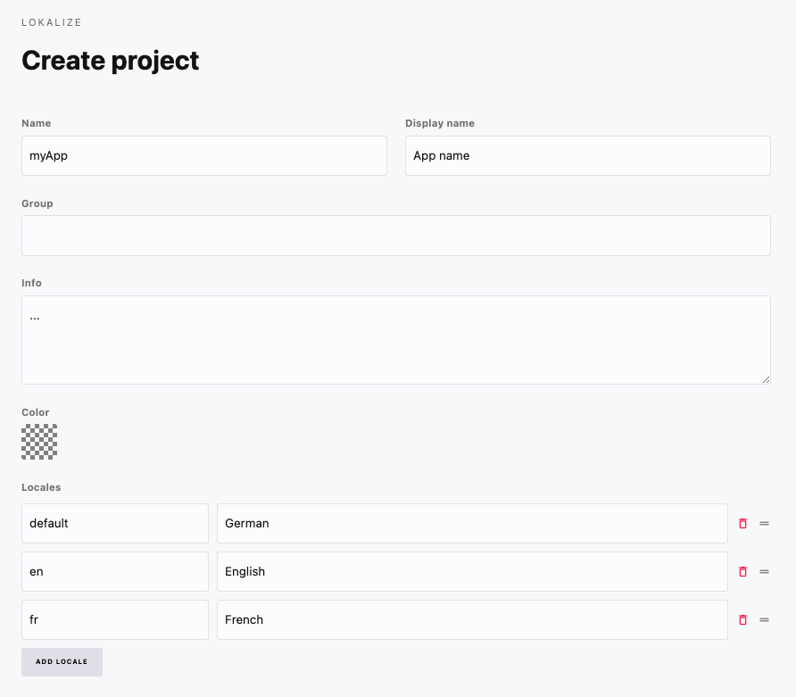
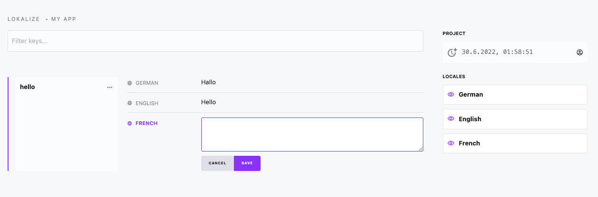

# Lokalize

Lokalize supports you in the internationalization of your product e.g. web or mobile app.

## Create a project

Create a project and define the target locales you want to manage.

## Translation keys

Manage multiple translation keys:

