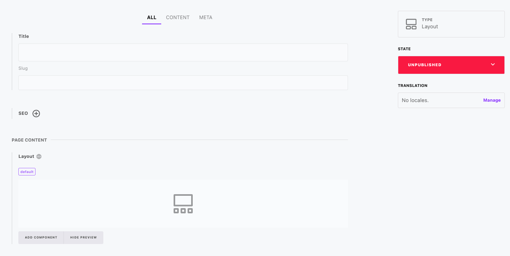
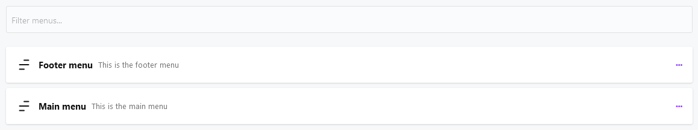

# Pages

[[toc]]

The Pages add-on is an extension takes a page-centric approach to content creation and editing,  simplifying the process of managing a classic site tree, SEO, and menus for your web application or website. As organizing and optimizing content is vital for creating a successful online presence, this powerful add-on offers developers an all-in-one solution for handling site structure and navigation with ease.

With the Pages add-on, developers can effortlessly create, organize, and manage pages within a hierarchical site tree, while also supporting multiple page types. This add-on streamlines the process of designing and maintaining website navigation, enabling you to create custom menus and adapt them to your project's unique requirements.

## Managing pages

### The list of pages

Note, that pages can be organized in a menu like way by dragging and dropping a page as a child of other pages.

### Create or edit a page

Each *Page* contains some common fields, such as a title, a slug and the SEO part. All additional content is organized in a Layout. Use the layout to create highly flexible and customized content foreach of your pages.

## Menus

While pages themselves are standalone pieces of data they are usually organized within one or more menus. Whenever you require a menu i.e. in the header or footer of a website, Cockpit's *Menus* feature can be used to organize your pages.

