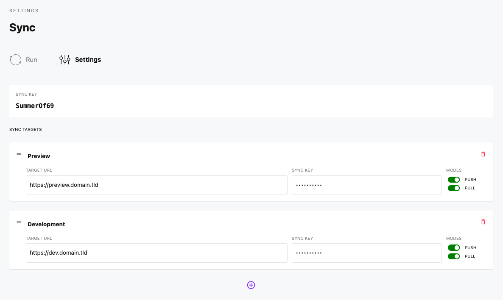
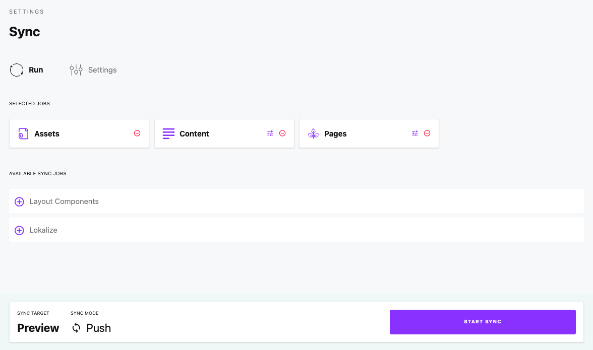

# Sync

Push or pull resources between different Cockpit instances.


## Sync key

::: Important
Define for each Cockpit instance its own sync key in Cockpits config file.
:::

`/config/config.php`

```php
<?php

return [
    'sync' => [
        'syncKey' => '***secretkey***'
    ]
];
```


## Sync targets

Go to **Settings > Sync** to manage your sync jobs.



## Run sync

Select the resources to sync and whether to push or pull content from the sync target.




