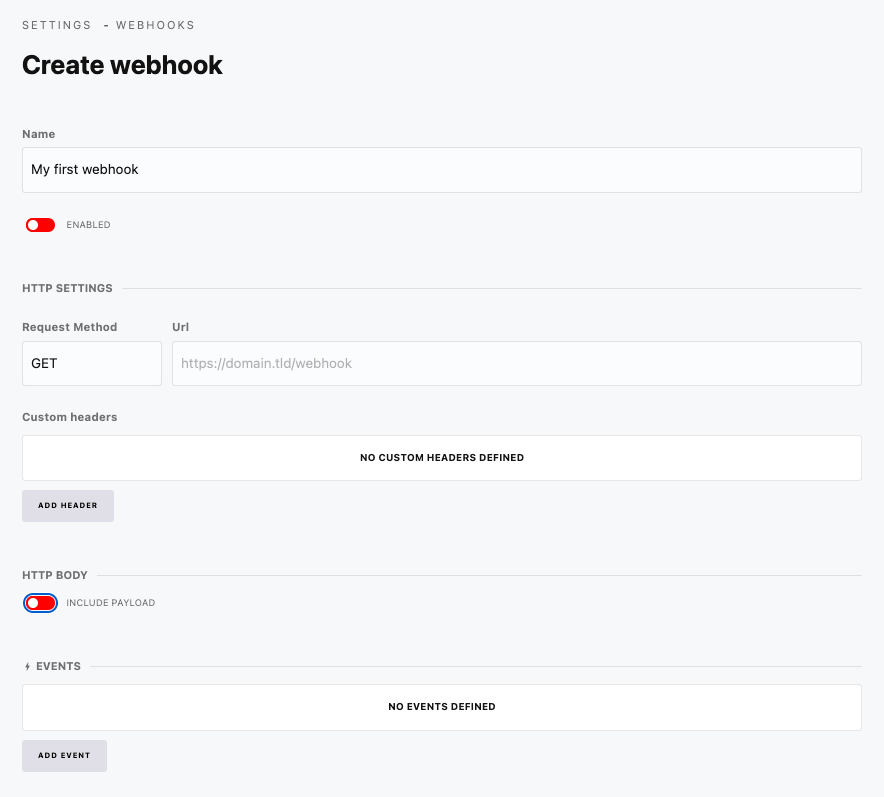

# Webhooks

Webhooks send HTTP requests when a specific Cockpit or module event is triggered.

Go to **Settings > Webhooks** to manage your sync jobs.

## Events

Some possible event names that can be used to trigger a wbhook:

- `content.item.save`
- `pages.page.save`
- `pages.page.save`
- `lokalize.project.save`